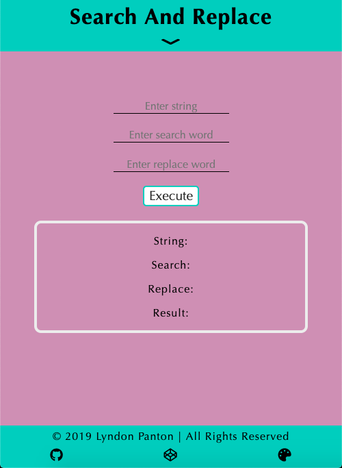

# Search And Replace

## How To Open
> 1. Go to the application's folder
> 2. Right click on the file named _index.html_
> 3. Choose the _open with_ option
> 4. Open the application in your desired browser

## How To Use
> 1. Enter a string into the first input field
> 2. Enter a word with no spaces into the second input field
> 3. Enter a word with no spaces into the third input field
> 4. Press the _Execute_ button
> 5. The string entered into the first input field will have all instances of the word entered into the second input field (case-sensitive) replaced with the word entered into the third input field

## Requirements
> 1. This application requires a browser to run
> 2. The browser must have JavaScript available and enabled

## Errors
> 1. N/A

## Extra Information
> 1. This was done for one of the activites in freecodecamp's Intermediate Algorithm Scripting section

## Preview

